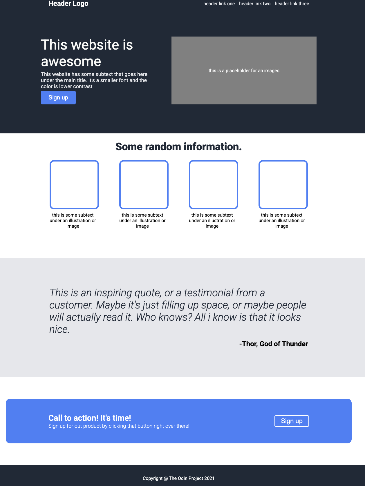
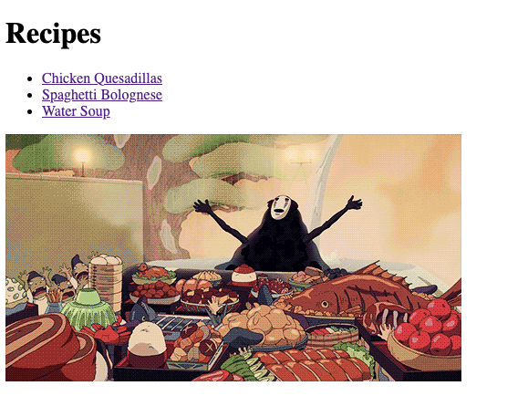

<h2 align="center">Hi, I'm <a href="https://github.com/kasharn">Kasharn</a> 👋</h2>

  Backend & Infrastructure Engineer · London, UK 
  I enjoy building systems end-to-end — from design to deployment. 
  Comfortable with automation pipelines, self-hosted infrastructure, 
  and writing Python that actually runs reliably in production.

---

<h1 align="center">🚀 Languages & Tools</h1>

<h3 align="center">⚙️ Core Languages</h3>

<table align="center">
  <tr>
    <td align="center" height="70" width="70">
      
       Python
    </td>
    <td align="center" height="70" width="70">
      
       SQL
    </td>
    <td align="center" height="70" width="70">
      
       Bash
    </td>
  </tr>
</table>

<h3 align="center">🏗️ Backend & Infrastructure</h3>

<table align="center">
  <tr>
    <td align="center" height="70" width="70">
      
       Docker
    </td>
    <td align="center" height="70" width="70">
      
       AWS
    </td>
    <td align="center" height="70" width="70">
      
       GCP
    </td>
    <td align="center" height="70" width="70">
      
       Linux
    </td>
  </tr>
  <tr>
    <td align="center" height="70" width="70">
      
       Proxmox
    </td>
    <td align="center" height="70" width="70">
      
       ZFS
    </td>
    <td align="center" height="70" width="70">
      
       Nginx
    </td>
    <td align="center" height="70" width="70">
      
       Unifi
    </td>
  </tr>
</table>

<h3 align="center">⚗️ DevOps & Tools</h3>

<table align="center">
  <tr>
    <td align="center" height="70" width="70">
      
       Git
    </td>
    <td align="center" height="70" width="70">
      
       Cloudflare
    </td>
    <td align="center" height="70" width="70">
      
       Tailscale
    </td>
  </tr>
</table>

<h3 align="center">📚 Currently Learning</h3>

<table align="center">
  <tr>
    <td align="center" height="70" width="70">
      
       React
    </td>
    <td align="center" height="70" width="70">
      
       Node.js
    </td>
    <td align="center" height="70" width="70">
      
       PostgreSQL
    </td>
    <td align="center" height="70" width="70">
      
       Ansible
    </td>
  </tr>
</table>

 

---

<h1 align="center">⭐ Featured Projects</h1>

<table>
  <tr>
    <td width="50%">
      <h2 align="center">E-commerce Automation Suite</h2>
      

        

          
        

        
<strong>Python · Docker · Amazon SP API</strong>

        

          Web crawling pipeline across 20+ UK retailers with profitability
          analysis via the Amazon SP API. Includes an inventory management
          backend and Chrome extension for sourcing.
        

      

    </td>
    <td width="50%">
      <h2 align="center">Homelab Infrastructure</h2>
      

        

          
        

        
<strong>Proxmox · Linux · Docker Compose ·  Python · Bash · ZFS</strong>

        

          Self-hosted environment running 50+ containerized services with
          VLAN isolation, ZFS storage integrity, automated backups, and
          secure ingress via Nginx + Tailscale.
        

      

    </td>
  </tr>
</table>

 

---

<h1 align="center">📖 The Odin Project</h1>

  Working through <a href="https://www.theodinproject.com">The Odin Project</a> full-stack
  curriculum to build a solid foundation in web development.
  Projects are added here as I complete them — newest first.

<table>
  <tr>
    <td width="50%">
      <h2 align="center">Landing Page</h2>
      

        
          
        

          
          
        

        
<strong>HTML · CSS</strong>

      

    </td>
    <td width="50%">
      <h2 align="center">Recipes</h2>
      

        
          
        

          
          
        

        
<strong>HTML</strong>

      

    </td>
  </tr>
</table>
